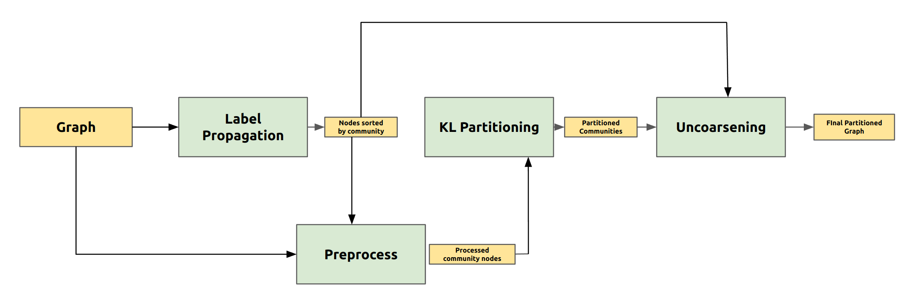
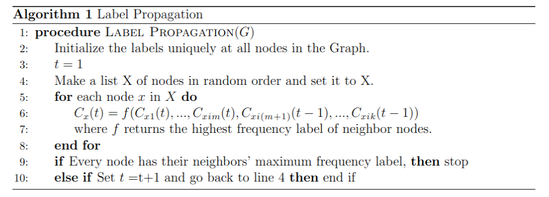

# Partitioning Real World Graphs with <br/> Label Propagation for Community Detection

Implementation of the term project for the course M2177.003000 Advanced Data Mining Course at SNU.<br/>

<br/>

> - Left image indicates a poor partitioned graph. There are many inter-partition links <br/>
> - Right image indicates a good partitoned graph. Vertices that are highly connected are assigned to the same partition.<br/>
> - Our method aims to reduce the number of vertex-cuts in the final partitioned graph.

## Environment Setup
> Clone the respository:
```
git clone https://github.com/yc4ny/Graph-Partitioning.git
```
> Note: This code was developed on Ubuntu 20.04 with Python 3.5. Later versions should work, but have not been tested.<br/>
> Create and activate a virtual environment to work in, e.g. using Conda: <br/>

```
conda create -n venv_graph python=3.5
conda activate venv_graph
```

> The codebase is implemented in Python 3.5.2 | Anaconda 4.2.0 (64-bit). Package versions used for development are just below.

```
networkx          2.4
tqdm              4.64.1
numpy             1.18.5
pandas            0.25.3      
python-louvain    0.11
texttable         1.6.7
```

> Install the requirements with pip:

```
pip install -r requirements.txt
```

## Data Preparation

### Format
The code takes an input graph in a csv file. Each row of the file indicates an edge between the two nodes separated by a comma.<br/><br/>
For small sample tests. there are custom test graphs in the  `dataset/custom` folder. <br/><br/>
If you wish to test on real world graphs, please download the network data from Stanford Large Network Dataset Collection here: <a href="https://snap.stanford.edu/data/" target="_blank">SNAP</a>, unzip and place the csv files in the ` dataset/`  folder.  <br/><br/>
To partition other graphs, please match the format of the input graph as stated above.<br/><br/>

### Folder Hierarchy
Once you sucessfully downloaded and unzips dataset files, you should have a directory similar to this:
   ```
    ./dataset/
    ├── custom
    │   └── sample_data.csv
    │   └── test_1.csv
    |   └── test_2.csv
    │   └── hand_detector
    ├── facebook_clean_data
    |   └──artist_edges.csv  
    |   └──athletes_edges.csv  
    |   └──company_edges.csv  
    |   └──government_edges.csv  
    └── git_web_ml
        └── musae_git_edges.csv
   ```
## Full pipeline
### Diagram of the pipeline of our project
<p align= "center">
<br/><br/>
</p>


## Community Detection - Label Propagation

<p align= "center">
<br/><br/>
</p>
The Label Propagation algorithm is a fast algorithm for finding communities in a graph, while detecting these communites using the network structure alone as its guide and does not require a pre-defined objective function or prior informations about the communities. The quality of community detection is determined with the modularity value.

### Algorithm

<p align= "center">
<br/><br/>
</p>

### Options

Clustering the input graph is done by the `label_propagation/label_propagation.py` script which provides the following command line arguments. <br/>

#### Model options

```
  --input               STR    Input graph path.                                   
  --assignment-output   STR    Node-cluster assignment path.                   
  --rounds              INT    Number of iterations.    
```

#### Example for running label propagation on the sample data

```
python label_propagation/label_propagation.py --input data/custom/sample_data.txt --assignment-output output/sample_data.json --rounds 20
```

Detected communities will be in the form of a `.json` file which can be found in  `output` folder. <br/>

#### Running Baseline Community Detection Algorithms

Other community detection algorithms such as the  <a href="https://en.wikipedia.org/wiki/Girvan%E2%80%93Newman_algorithm" target="_blank">Girvan Newman</a>, and the <a href="https://en.wikipedia.org/wiki/Louvain_method" target="_blank">Louvain</a> algorithm can be found in `baseline_tests/communitydetection` folder. Update the `test.py` according to the algorithm you wish to test, and run the file.

## Graph Partitioning - Kernighan-Lin

<p align= "center">
<br/><br/>
</p>
The Kernighan-Lin (KL) algorithm takes an undirected graph as input and partitions the vertices into two disjoint subsets A,B of equal(or nearly equal) size, in a way that minimizes the sum of the weights of the subsets of edges that cross from A,B.

### Model options

```
  --input_dir    STR    Input graph path. 
  --output_dir   STR    Partitioned graph path.                                           
```

#### Example for running KL on the sample data

```
python baseline_tests/Kl_partitioning/kl.py --input data/custom/sample_data.txt  
```

Partitioned graph will be in the form of a `.json` file which can be found in  `output` folder. <br/>

### Algorithm

<p align= "center">
<br/><br/>
</p>
